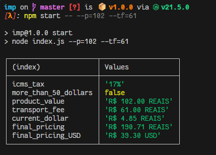

<h1 align="center">
    🧮 Imp
</h1>

## what is this?
silly code to calculate product values and taxes from buying on marketplaces outside Brazil.
this uses [Api de Moedas](https://docs.awesomeapi.com.br/api-de-moedas) to get the USD-REAL cotation.

most of informations about the taxes are in code as comments, if you are curious about the calc.

<div align="center">
    </img>
</div>

## how to use?
```shell
npm start -- --h
```
or
```shell
node .\index.js --h
```
### options
- *--p=* Value of the product.
- *--tf=* Value of the transport fee (Default value is 0).
- *--icms=* Value of the tax for instate and interstate operations (Default value is 17% - use porcentage).